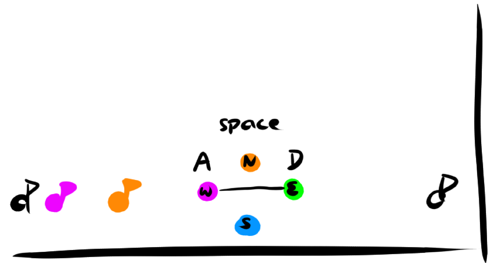
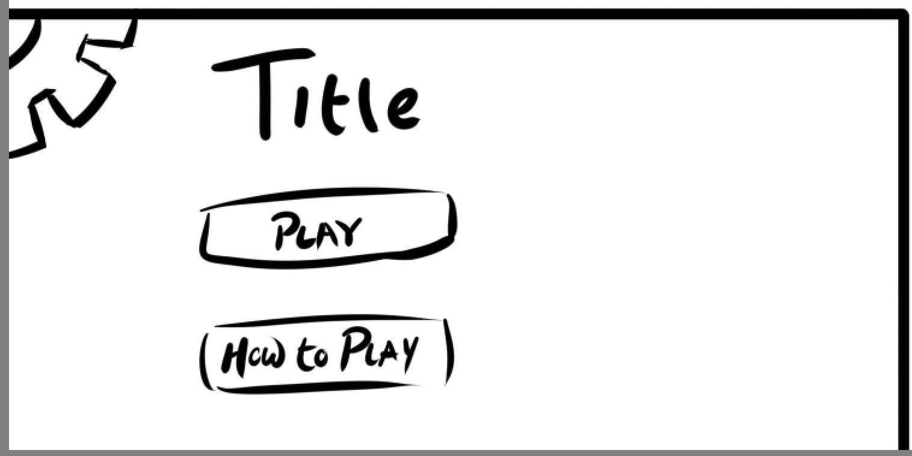
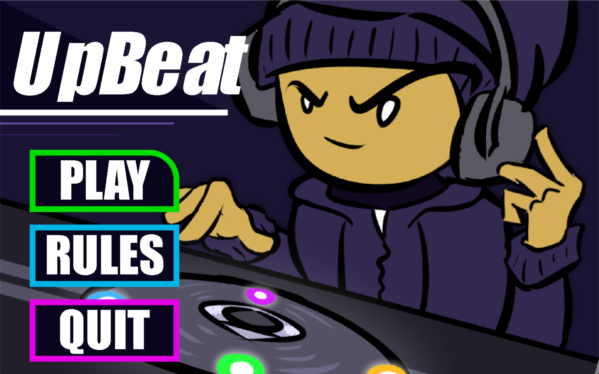
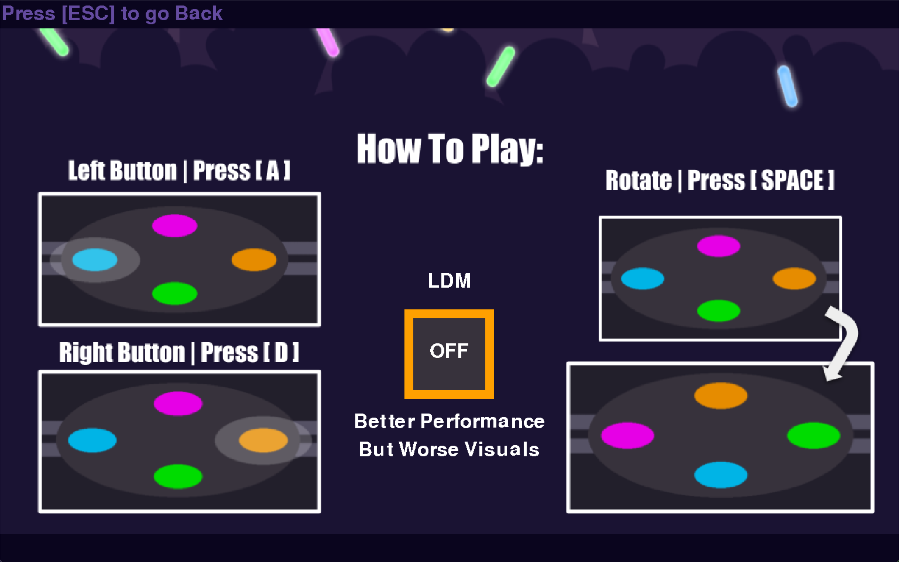
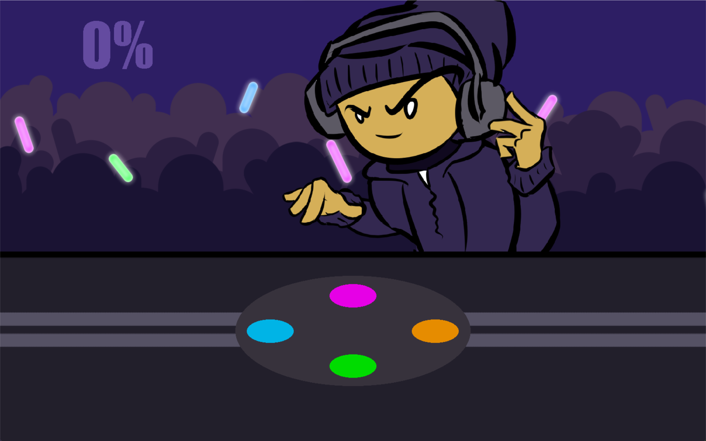
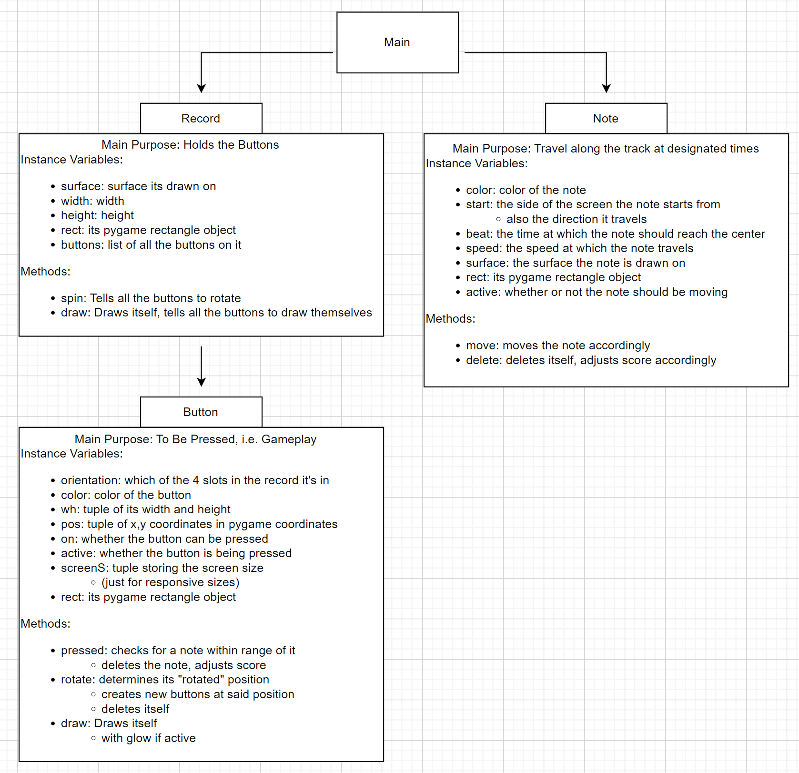

:warning: Everything between << >> needs to be replaced (remove << >> after replacing)
# CS110 Project Proposal
# UpBeat
## CS 110 Final Project
### Fall, 2022
### [Assignment Description](https://docs.google.com/document/d/1H4R6yLL7som1lglyXWZ04RvTp_RvRFCCBn6sqv-82ps/edit?usp=sharing)

https://github.com/bucs110FALL22/final-project-bradley-and-joseph

https://docs.google.com/presentation/d/1M-YlEWq-w3O_cC81A6ncQaCJwq4f05Qk_ocL5hgvGgc/edit?usp=sharing

### Team: Bradley and Joseph
#### Bradley Vaval and Joseph Michaud

***

## Project Description

# We aim to create a gimmicky rhythm game with mechanics similar to games like Dance Dance Revolution and Guitar Hero with tracks, notes, and terminals for the notes that respond to button inputs. What would make our game different is that the tracks are arranged in a cross pattern with the notes converging in the center. To keep it from being too overwhelming, only the left and right tracks are active at a time and the player has the ability to rotate the order of the terminals. It's admittedly difficult to explain, but visually a simple concept, and simple concepts with lots of applications make for potentially difficult but enjoyable gameplay.
***    

## User Interface Design

- **Initial Concept**
  - 
  - 
    
    
- **Final GUI**
  - 
  - 
  - 

***        

## Program Design

* Non-Standard libraries
    * time
         - https://docs.python.org/3/library/time.html
         - Can provide the real world passing time
    * math
         - https://docs.python.org/3/library/math.html
         - Allows you to use more complex mathematical functions and values
    * sys
         - https://docs.python.org/3/library/sys.html
         - Allows the use of variables normally hidden behind the hood of your system
* Class Interface Design
    * << A simple drawing that shows the class relationships in your code (see below for an example). This does not need to be overly detailed, but should show how your code fits into the Model/View/Controller paradigm. >>
        *  
* Classes
    * Record: surface, height and width, list of buttons
      * init: Creates the record in which the buttons will be drawn on
      * spin: Spins the record and then tells the buttons to change position
      * draw: used to draw the record and tell the buttons to draw themselves

    * Button: color, orientation, position, active, on
      * init: creates a button in the desired position, with a designated
      * pressed: called when the button is pressed, detects for notes to be deleted
      * rotate: when the record is rotated, this will create new buttons in the rotated position
      * draw: used to draw the buttons

    * Note: color, start, beat, spead, active
      * init: Creates the note which will travel along the screen
      * move: Moves the note according to its speed and direction
      * delete: Deletes the note, adjusts score

## Project Structure and File List

The Project is broken down into the following file structure:

* src
  *  Main
  *  Variables
  *  Colors
  *  Sequences
  *  Objects:
    *  Record
    *  Button
    *  Note
* assets
    * Songs
      * Menu
      * Tutorial Final 
      * Sweden 
    * Sounds
      * Miss 
      * Scratch 
      * Start 
      * Yells
    * Images
      * Crowd 
      * DJ
      * How2
      * Table
      * TempBkg
* etc

***

## Tasks and Responsibilities 

   * Outline the team member roles and who was responsible for each class/method, both individual and collaborative.
  #Bradley did the art work and game logic
  #Joseph did the menu logic and music sounds
## Testing

* << Describe your testing strategy for your project. >>
  #Ran the program frequently, if there was a bug we would do our best to fix it before moving on or committing.
## ATP

| Step                 |Procedure             |Expected Results                   |
|----------------------|:--------------------:|----------------------------------:|
|  1                   | start the program |menu window should open  |
|  2                   | click play  | should open a menu for easy or hard mode    |
|3|click easy or hard|should open the main game on the selected mode|
|4|click the notes when they move into the buttons using A or D|should make the notes disabpear|
|5|if the notes are on a diffrent color not assigend to A or D click space to change the color rotation|should spin the record|                     

